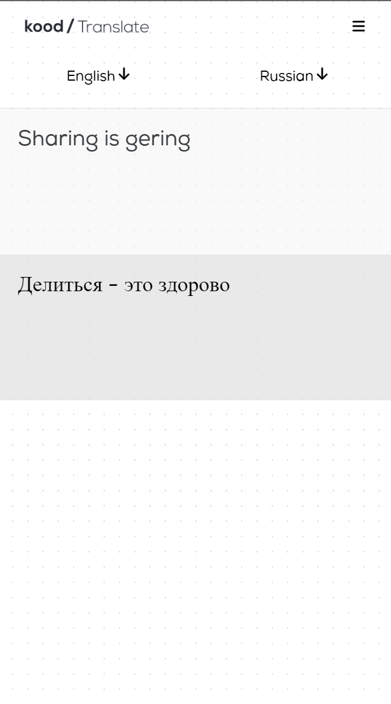

<!-- ctrl + shift + v to preview -->
# kood-homework

## kood/Jõhvi Junior Developer job application stage 2 homework 12.01.2024 - Translator


## **Table of Contents**
* ### [Technologies Used](#technologies-used-1)
* ### [Setup](#setup-1)


## Technologies Used
[TypeScript](https://www.typescriptlang.org/)

[Svelte](https://svelte.dev/)

[Vite](https://vitejs.dev/)

[PostgeSQL](https://www.postgresql.org/)

[Spring Boot](https://spring.io/projects/spring-boot/)

[Docker](https://www.docker.com/)

## **Setup**
Clone the repo:
```
https://github.com/JesusKris/kood-homework
```

Setup local test PostgreSQL database using Docker:
```sh
chmod +x setupTestDB.sh

./setupTestDB.sh
```

Run Translation API using Gradle with your Deepl API key passed in:

```sh

cd ./translationapi

./gradlew bootRun --args='--spring.profiles.active=production --TRANSLATION_API_DEEPL_KEY='
```

Run the frontend:

```sh
cd client

npm run install

npm run dev
```

Image of the app

